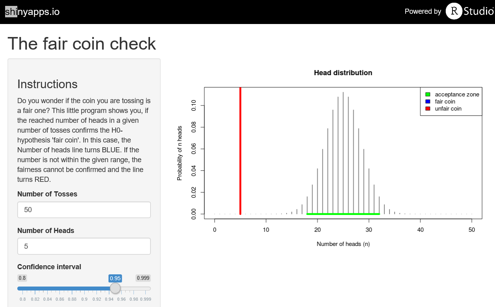

## The task

Students participating in the class "Developing data products" within the Coursera Data Science Specialization must show that they have the basic skills to

1. identify data-related questions
2. convert the questions, data and analysing methods into an application to answer the questions (using Shiny)
3. make their ideas available to non-data-scientists in presentations including reproducible R-code

--- .class #id 

## The project

My course project with Shiny will be an application to support decision making about the "fairness of a coin".

With it a user can visualize the influence of the variables   

- total number of tosses 
- attained number of heads
- desired confidence level   

on the statistical classification of a coin as fair or unfair.


--- .class #id 

## The application
The shiny application (have a try here: https://th80689.shinyapps.io/shiny) consists of two parts:  

1. <b>ui.R:</b> the user interface that accepts the input parameters "Number of Tosses", "Number of Heads" and "Confidence interval"  

2. <b>server.R:</b> the server part that plots a probability function for the expected occurrences of heads in a given number of tosses - including the acceptance zone for the given number of tosses for a fair coin (green) and the classification of the coin into a fair (blue) or unfair (red) according to the given number of heads and confidence interval

The code for ui.R, server.R and this presentation can be found on https://github.com/Th80689/devdataprod.

P.S.: For sake of the requirement 4: "It must contained some embedded R code that gets run when slidifying the document" - this presentation was created/updated on 
```{r r_code_part, echo=FALSE, message=FALSE} 
Sys.Date()
``` 

--- .class #id  

## The application (Example)
   

